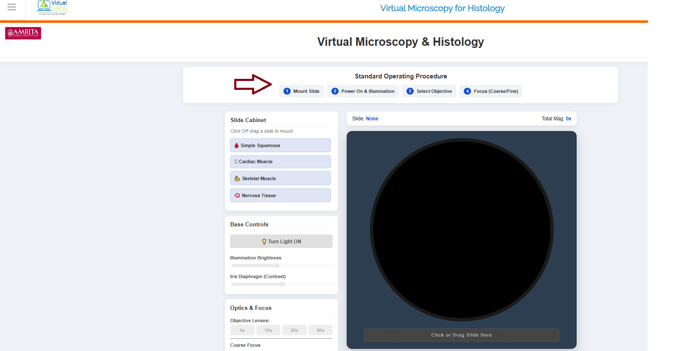
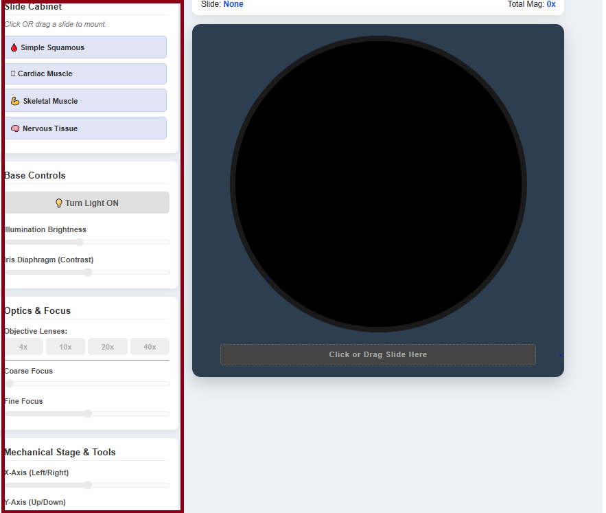
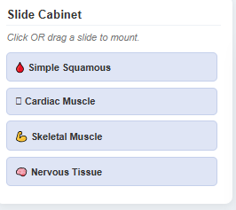
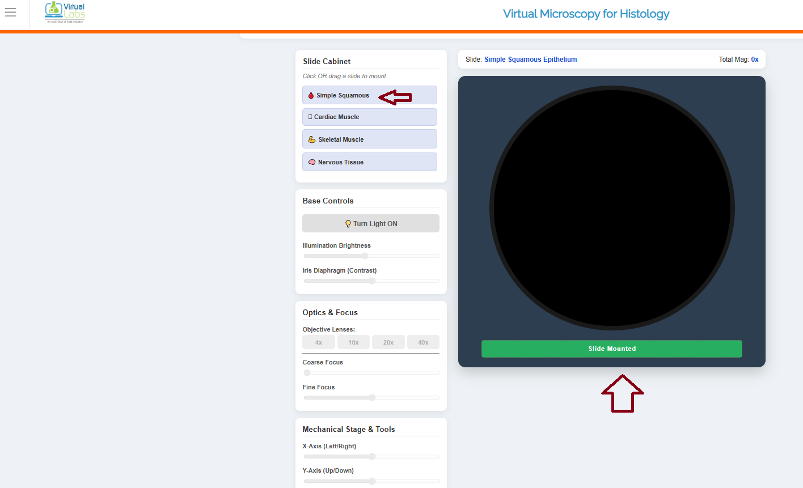
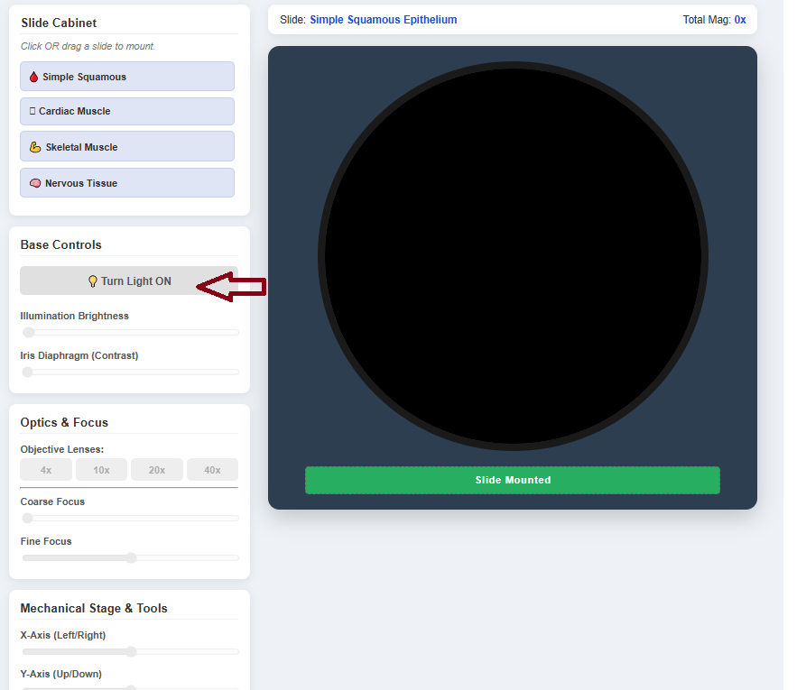
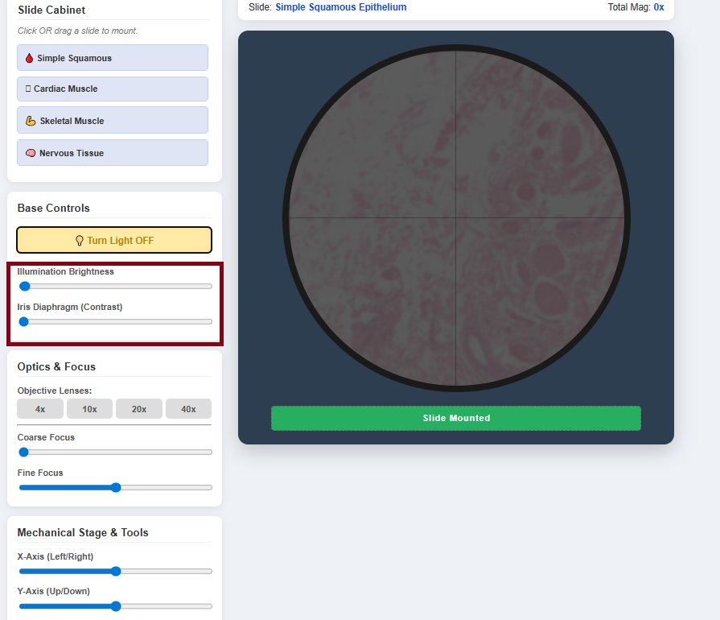
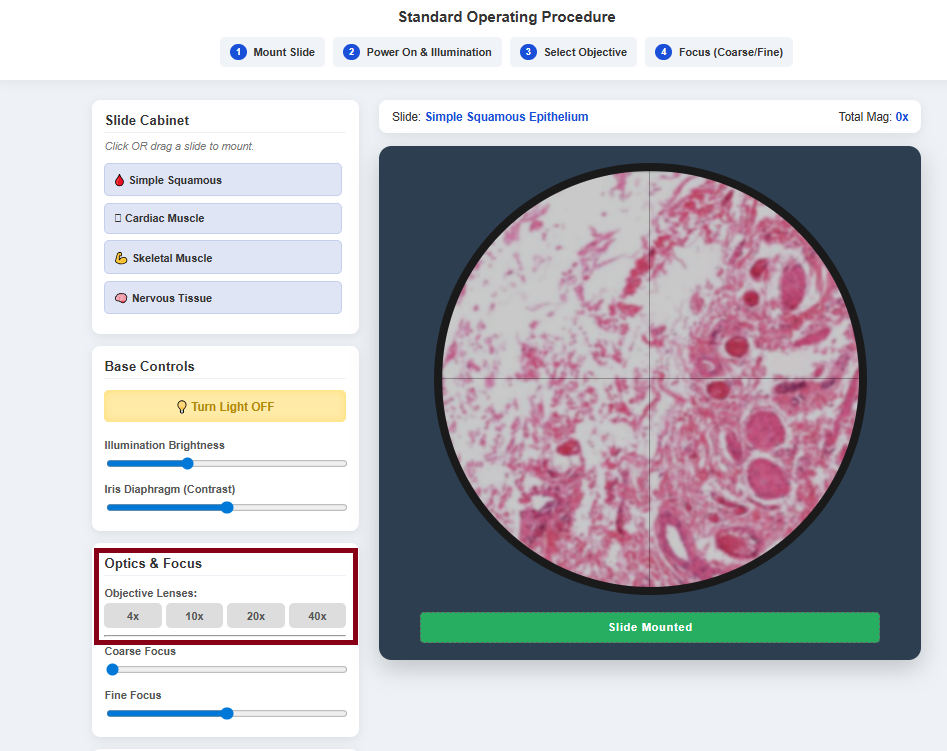
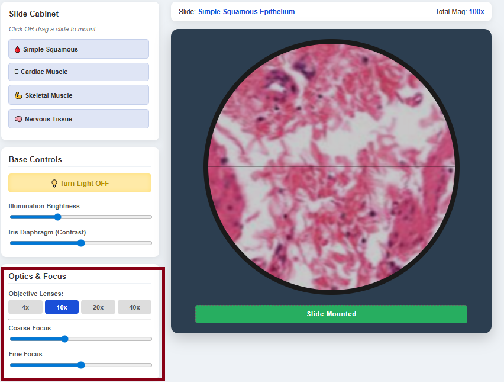
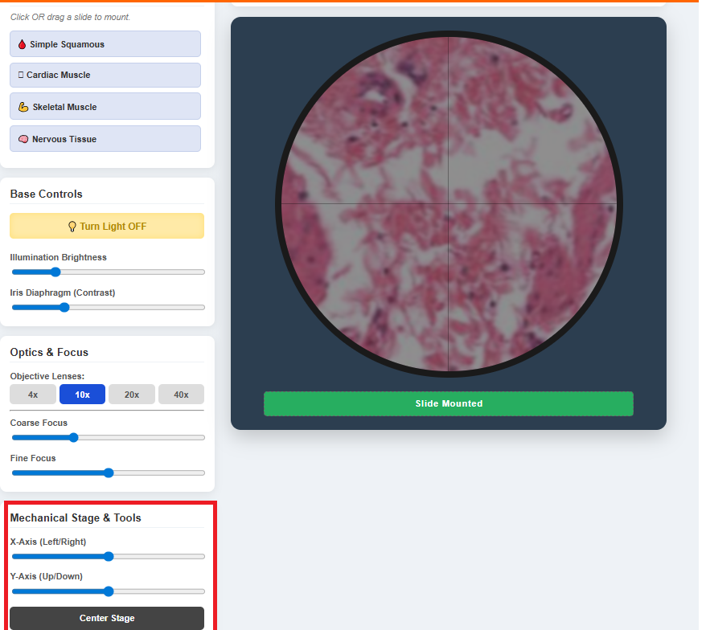

### Steps to work the simulator

1. Click on the simulator tab to start the experiment. In the simulator window, the standard operating procedure for the experiment is provided. 

  

&nbsp;

&nbsp;
 
2. The basic components of the virtual microscope were provided in the simulator window.

  

&nbsp;

&nbsp;

3. To begin the simulation, users can select a specimen from the available cell types provided in the simulator window.

  

&nbsp;

&nbsp;
  
4. Here, as an example, simple squamous epithelial cells are used as a specimen. When the specimen is selected, the microscope view part shows slide mounted. This means that the specimen has been prepared for observation under a microscope.

  

&nbsp;

&nbsp;
 
5. After mounting the slide, the next step is to illuminate the specimen. Click the “Turn on Light” button in the base control to view the tissue under the microscope.

  

&nbsp;

&nbsp;
 
6. The user can adjust the illumination brightness and the iris diaphragm by moving the cursor for better visualization of the specimen.

  

&nbsp;

&nbsp;

7. The user can change the objective lens to improve magnification. 4X, 10x, 20X and 40X lenses are provided as examples.

  

&nbsp;

&nbsp;
 
8. Here, as an example, a 10X objective lens is selected for microscopic observation to bring the specimen into clear focus. Then the user can change the Coarse adjustment and fine adjustment to bring the specimen into clear focus.

  

&nbsp;

&nbsp;

The user can change the mechanical stage tools to move the slides to the left, right, up and down positions. The center stage will keep the specimen in the middle of the microscopic view.

  

&nbsp;

&nbsp;

### Observation
The observation for squamous epithelial cells is that the Nucleus stains blue to purple due to haematoxylin, and the cytoplasm appears pink due to the eosin stain. The cells are flat and thin in appearance, and the nuclei are in the central layer, forming a single layer 

