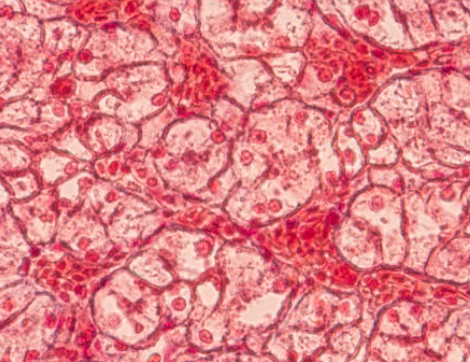
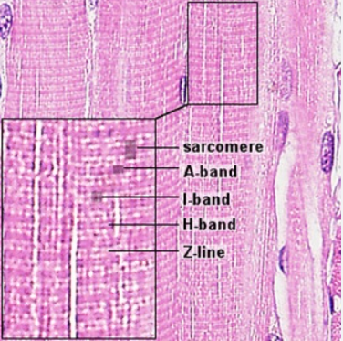
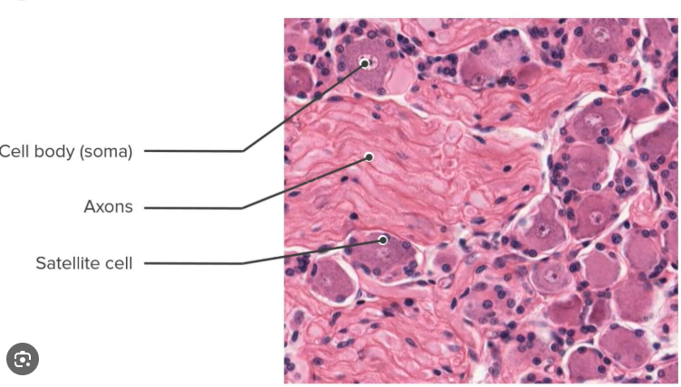

Histology refers to the study of cells, tissues, and organs that are seen through the microscope. It helps to understand cellular organization, the extracellular matrix, and the functions of the tissues. The histological slides are usually viewed under a light microscope, but the field of vision and magnification are limited. In a laboratory education, to ensure that the same field gets visualized by all the students, an alteration in the selected field is not considered. Screening the entire slide is not allowed in such cases. Also, changing the objective lens to get magnification in any part of the tissue is not considered.  Maintaining an adequate slide collection is another concern in the education field. Proper care of the slides to avoid fading of the dye or slide damage is another concern. To address these drawbacks, modification in the use of conventional microscopy bas been developed. The acceleration of microcomputer technology has contributed success for the presentation of image-intensive information in histology. Virtual microscopy provides an alternative method to conventional laboratory techniques in histology to provide learning experiences to use a microscope and glass slides like the use in conventional laboratory settings.  Even though the successful study of histology requires a balance between conventional microscopy and virtual microscopy, virtual microscopy can become an important component of teaching–learning process to enhance knowledge and performance. 

&nbsp;

### Virtual Microscopy in Histology
Virtual microscopy refers to a technique that employs digitization of the microscopic glass slide that can be analyzed on a computer or tablet screen, simulating real experience as in a conventional light microscope. The virtual slides are high-magnification images of tissue sections. 

&nbsp;

#### Components of a virtual microscope
1. **Specimen image/ Digital slide**: This is a high-resolution image of a real histological slide. It is used to replace the physical slide with a similar visual representation as in the real laboratory. The commonly included specimens are tissues like epithelial cells, muscle tissues, nervous tissues and connective tissues. The digital slides maintain the natural staining patterns of Hematoxylin and Eosin stain, which is widely used in histology to visualize tissue structure. Hematoxylin is a basic dye that stains the nuclei in blue or purple colour, and Eosin, an acidic dye, stains the cytoplasm and extracellular matrix in pink. 

2. **Viewer interface**: This is the user interface or web-based platform that displays the virtual slide. It simulates all the microscopic functions digitally. The web platform has menus for user interaction, toolbars, and navigation options. Also, the interface provides control for zooming the image, stage movement, illumination, and magnification of the image.

3. **Objective lens**: The objective lens gathers the light and provides high power magnification to create a sharp and real image. The resolution of the image depends on the ability of the instrument to distinguish fine details for obtaining a sharp and clear structure of the object. The common magnifications used are 4X, 0X,20X, 40X, and sometimes 100X are preferred. The magnification enables detailed examination of nuclei and other cytoplasmic structures. This digital magnification helps in avoiding changing the mechanical lens and physical damage to the microscopic slide, but mimics the functions of a real microscope.

4. **Focus control knobs**: These are the coarse and fine focus knobs of the microscope. The coarse adjustments help to bring the slide into view, and the fine adjustments sharpen the image for clearer visualization. It is useful in studying the clear visualization of tissues and cellular structures.

5. **Stage control**: This helps to virtually control the movement of the slide. Using this, the specimen slide can be moved up, down, left and right. It helps to position the viewing field accurately. It functions similarly to the mechanical stage of the real microscope.

6. **Illumination control**: This helps to control the light sources to the microscope to adjust visibility. It helps to adjust the brightness and contrast of the image. It simulates the iris diaphragm and light intensity of a real microscope and enhances the visualization of tissue structures and staining differences.

&nbsp;

### Common specimens used in a histology laboratory
• **Squamous epithelial cells**: These are cells from the epidermis(skin), blood vessels lining and lungs' alveoli. In a virtual microscopy, the cells are identified by the presence of thin, flat, scale-like cells. The nucleus is small, oval, or flattened. The nucleus is stained purple or blue by the H and E staining. The cytoplasm of the squamous epithelial cells is thin and often visible at high magnification lenses (Figure 1).

&nbsp;

  
   
  <i>Figure 1. Microscopic view of squamous epithelial cells 
  Source: https://www.istockphoto.com/photos/squamous-epithelial-cell 
</i>

&nbsp;

• **Cardiac muscle tissues**: The nuclei of the cardiac muscles are centrally located, which are either mononucleated or sometimes binucleated. The hematoxylin stains the nuclei blue or purple by binding to DNA in the nucleus. The cytoplasm is stained pink as the eosin binds to the cytoplasmic proteins, and the intensity of the staining depends on protein content. The characteristics of cardiac muscles are their faint striations, alternating light and dark bands, which are visualised using higher magnification lenses such as 40X. Another feature is the intercalated disc that is observed as dark, slightly thickened lines across the fibres. The fibres are branched and form networks for coordination contraction (Figure 2).

&nbsp;

  
   
  <i>Figure 2. Microscopic view of cardiac muscle 
  Source: https://vmicro.iusm.iu.edu/hs_vm/docs/lab4_5.htm 
</i>

&nbsp;

• **Skeletal muscle**: Here, the nuclei are located in multinucleated fibers and are located at the periphery of the fibers under the sarcolemma, the cell membrane. It is stained in blue or purple by the hematoxylin stain. The cytoplasm has contractile proteins, the actin and myosin, which are stained pink by the eosin stain. The skeletal muscles have striations that are indicated by alternating light and dark bands representing organized sarcomeres. The fibers are long and cylindrical, without forming any branches, and are parallel to each other. In microscopy, it gives a linear and organized appearance (Figure 3).  

&nbsp;

  
   
  <i>Figure 3. Microscopic view of skeletal muscle 
  </i>

&nbsp;

• **Nervous tissue**: In the nervous tissue, the soma, that is the cell body, appears light pink in the cytoplasm. The nucleus stains dark with a prominent nucleolus. The nissil bodies appear as granules with a purple appearance. The axons and dendrites are stained pink, and the glial cells appear in dark blue (Figure 4).
&nbsp;

  
   
  <i>Figure 4. Microscopic view of nervous tissue 
Source: https://pressbooks.pub/rbtallitsch/chapter/chapter-7-nervous-tissue
  </i>

&nbsp;

In histology, the virtual microscope can be used as an interactive learning platform for students to study the identification of histological tissues. It can be used as a remote teaching tool by the teachers without needing a physical laboratory environment. Multiple tissue sections can be compared easily without time constraints.

